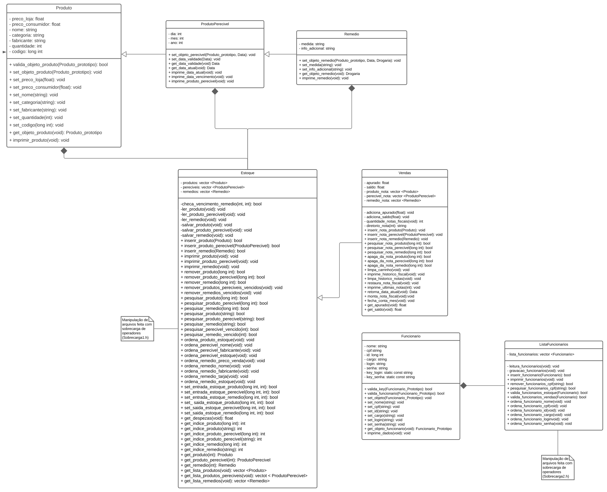
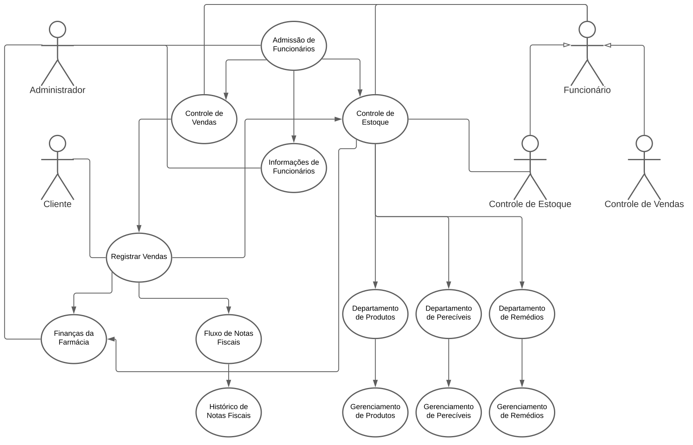

# Controle de Estoque e Vendas (v1.5.0)
#### Projeto de controle de estoque e vendas em Farmácia.

### Versões do Projeto

|**Documentação**|**Link para Download**|
|:---------------|:---------------------|
|[Pré-lançamento - documentação](https://github.com/Alyssonmach/controle-estoque-vendas/releases/tag/v0.5)|[controle-estoque-vendas-0.5](https://github.com/Alyssonmach/controle-estoque-vendas/archive/v0.5.zip)|
|[Pré-lançamento - documentação](https://github.com/Alyssonmach/controle-estoque-vendas/releases/tag/v0.8.5)|[controle-estoque-vendas-0.8.5](https://github.com/Alyssonmach/controle-estoque-vendas/archive/v0.8.5.zip)|
|[Pré-lançamento - documentação](https://github.com/Alyssonmach/controle-estoque-vendas/releases/tag/v0.9.9)|[controle-estoque-vendas-0.9.9](https://github.com/Alyssonmach/controle-estoque-vendas/archive/v0.9.9.zip)|
|[Lançamento - documentação](https://github.com/Alyssonmach/controle-estoque-vendas/releases/tag/v1.0.0)|[controle-estoque-vendas-1.0.0](https://github.com/Alyssonmach/controle-estoque-vendas/archive/v1.0.0.zip)|

### Membros do projeto

- **Alysson Machado** (Membro responsável por modelar o formato dos objetos das classes e implementação do estoque da farmácia);
- **Nathan Ferreira e Marcos Pereira** (Membro responsável por implementar o funcionamento da classe de Vendas, essa que tem comunicação direta com o estoque);
- **Iago Miguel** (Membro Responsável por cuidar da gestão dos funcionários da farmácia, determinando o modelo de cadastro por objetos);

### Objetivo

Implementar um projeto que faça o controle de estoque e vendas de uma farmácia usando a linguagem de programação C++. 

### Diagrama UML

> [Visualizar melhor](https://github.com/Alyssonmach/controle-estoque-vendas/blob/v1.0.0/diagramacao/controle-estoque-vendas-farmacia.svg)

### Diagrama de Caso de Uso

> [Visualizar melhor](https://github.com/Alyssonmach/controle-estoque-vendas/blob/v1.0.0/diagramacao/caso-de-uso-controle-estoque-vendas-farmacia.svg)

### Material Utilizado

- [x] Todo o projeto foi versionado utilizando o Git, possibilitando rastrear e organizar cada etapa de progresso;
- [x] O projeto foi desenvolvido utilizando a linguagem de programação C++, como fruto da conclusão da disciplina Técnicas de Programação, na Universidade Federal de Campina Grande, curso de Engenharia Elétrica;
- [x] O projeto foi desenvolvido utilizando o conhecimento de orientação a objetos, através da criação de classes e classes com herança, seguido do posterior desenvolvimento dos seus métodos. Além disso, foi definido um fluxo de comunicação entre as classes;
- [x] Utilização de  Tratamento de exceções  e erros, manipulação de arquivos e alocação dinâmica (possibilitado com a implementação de um Vector);
- [x] Especificação do Diagrama UML e do diagrama de Casos;
 
### Classes e Métodos Implementados

#### Sobrecarga1 e Sobrecarga2 

As implementações de Sobrecarga1 e Sobrecarga2 são responsáveis por realizar sobrecarga em operadores específicos, de modo que seja possível fazer toda a parte de manipulação com os arquivos nos construtores e destrutores, garantido que as listas de objetos sejam lidas logo no início da execução e sobrescritas ao final da execução. Com essas implementações, é possível realizar a manipulação de arquivos em listas de Vector de forma rápida e prática nas seguintes classes:
- [x] Classe Produto;
- [X] Classe ProdutoPerecivel;
- [X] Classe Remedio;
- [X] Classe Funcionário;

#### Produto 

A classe Produto é responsável por armazenar diversos atributos de um objeto não perecível. Envolve informações sobre preço de aquisição, preço de compra, nome do produto, nome do fabricante, categoria, quantidade em estoque e código de barras do produto. Os métodos são referentes a configuração e impressão dos atributos.

#### ProdutoPerecivel 

A classe ProdutoPerecivel é responsável por armazenar diversos atributos de um objeto perecível. Sendo uma classe que tem herança com a classe Produto, ela vai englobar todos os métodos envolvidos nessa classe, com o adicional de uma data de validade. Além disso, foi implementado um método que computa a data atual do produto, de modo que seja possível verificar se tal produto está vencido ou não.

#### Remedio

A classe Remedio é responsável por armazenar diversos atributos de um objeto perecível. Sendo uma classe que tem herança com a classe ProdutoPerecivel, ela vai englobar todos os métodos envolvidos nessa classe, com o adicional de informações de medidas do remédio e informações da finalidade desse remédio.

#### Funcionario 

A classe Funcionario é responsável por armazenar diversos atributos dos empregados da farmácia, tais como nome, cpf, cargo, login e senha. Através dela, será possível ter um controle do acesso de funcionários em determinadas áreas da farmácia, podendo ser divididas entre os seguintes cargos:

- [x] Controle de Vendas;
- [x] Controle de Estoque;

#### Estoque 

A classe Estoque é responsável por realizar o gerenciamento dos produtos disponíveis para venda na farmácia. Os seus atributos são capazes de armazenar todos os objetos pertencentes a classe Produto, ProdutoPerecivel e Remedio em um Vector. Desse modo, foi implementado os seguintes métodos:

- [x] Métodos para checar o vencimento de produtos Perecíveis e Remédios;
- [x] Métodos para ler as listas de Produtos, Produtos Perecíveis e Remédios armazenados em um arquivo; 
- [x] Métodos para salvar as listas de Produtos, Produtos Perecíveis e Remédios armazenados em um .arquivo; 
- [x] Métodos para inserir os Produtos, Produtos Perecíveis e Remédios nas listas de Vector;
- [x] Métodos para imprimir os Produtos, Produtos Perecíveis e Remédios nas listas de Vector;
- [x] Métodos para remover os Produtos, Produtos Perecíveis e Remédios nas listas de Vector;
- [x] Métodos para remover os Produtos, Produtos Perecíveis e Remédios que estão vencidos nas listas .de Vector;
- [x] Métodos para pesquisar os Produtos, Produtos Perecíveis e Remédios nas listas de Vector;
- [x] Métodos para pesquisar os Produtos, Produtos Perecíveis e Remédios que estão vencidos nas listas de Vector;
- [X] Métodos que retornam um objeto armazenado na lista de Vector através do índice;
- [x] Métodos para retornar todas as listas de vector que armazena os objetos Produto, Produto Perecível e Remédio armazenados em arquivos distintos;
- [x] Métodos para realizar a ordenação nos dados através dos atributos distintos associados as classes de objetos;
- [x] Métodos que alteram a quantidade de cada um dos produtos distintos no estoque;
- [x] Método que calcula a despesa no estado atual da farmácia, conforme o preço de aquisição dos produtos e sua quantidade em estoque;

#### Vendas 

A classe Vendas é responsável por fazer a comunicação indireta com o Estoque. Através dela, os funcionários de uma farmácia poderiam vender os produtos disponíveis no estoque, elaborar notas fiscais das compras realizadas e ter uma análise rápida do saldo, apurado e despesas da farmácia em um determinado mês. Nessa classe, estão envolvidos os seguintes métodos:

- [x] Métodos para computar a gestão financeira da empresa a cada venda realizada;
- [x] Métodos que fazem a gestão do fluxo de notas fiscais no diretório, permitindo dinamizar a forma como as notas fiscais podem ser salvas e visualizadas;
- [x] Métodos que pesquisam diversos tipos de produtos no estoque, de modo que seja possível vendê-los;
- [x] Métodos que permitem remover produtos que já passaram pelo caixa, caso o consumidor repense a compra de algum item, permitindo que tal produto estorne para o estoque;
- [x] Métodos que limpam e restauram o histórico de notas fiscais, mantendo-as intactas em outro diretório;
- [x] Método que imprime na tela do usuário as últimas n notas elaboradas;
- [x] Método que fecha as contas do mês, recomeçando toda a apuração da parte de finanças da farmácia;
- [x] Métodos que retornam o apurado e o saldo mensal da farmácia;

#### ListaFuncionarios

A classe ListaFuncionarios possui a finalidade de fazer a gestão de funcionários da farmácia. Ela é responsável por armazenar informações de cadastro dos funcionários, criando senhas de acesso específica para cada um deles. Há três tipos distintos de cadastro:

- [x] Cadastro do Administrador;
- [x] Cadastro de funcionários de vendas dá poder aos membros de gerar saída de produtos no estoque por meio de notas fiscais;
- [x] Cadastro de funcionários de estoque dá livre acesso ao estoque da loja, de modo que seja possível implementar todos os métodos envolvidos na classe Estoque;

Sendo uma classe que herda de Funcionario, ela possuí todos os atributos ligados a essa classe, podendo armazenar cada objeto em uma lista de Vector. Na classe ListaFuncionarios, foi implementado os seguintes métodos:

- [x] Métodos parar inserir objetos do tipo Funcionario na Lista de Vector e imprimi-los;
- [x] Método para realizar a remoção de qualquer funcionário da lista pelo cpf;
- [x] Método para pesquisar funcionários da lista pelo cpf;
- [x] Métodos para validar o acesso de funcionários da parte do Controle de Vendas e Controle de Estoque, através de login e senha previamente definidos;
- [x] Métodos para ordenar a lista de vector ligado a todos os possíveis atributos da classe Funcionario;

### Diretórios

#### arquivos

- [x] Contém todos os arquivos de texto .txt que armazenam em lista os objetos do tipo Produto, ProdutoPerecivel e Remedio;

#### notasfiscais 

- [x] Contém todo o fluxo de notas fiscais, mantendo um diretório a parte para salvá-las e outro como todo o histórico de notas fiscais das vendas realizada;

#### funcionarios

- [x] Contém todos os arquivos de texto .txt que armazenam em lista os objetos do tipo Funcionario;
 
#### cabecalhos

- [x] Contém todos os arquivos de cabeçalho .h das classes utilizadas no projeto;

#### implementacoes

- [x] Contém todos os arquivos de implementação .cpp das classes utilizadas no projeto;

#### testes

 - [x] Contém todos os arquivos de teste .cpp que para verificar o funcionamento de cada um dos métodos da classe;
